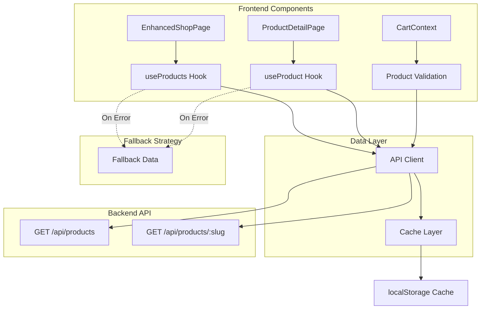

# Design Document

## Overview

This design integrates the existing backend product API endpoints with the frontend shop pages. The solution replaces static fallback data with dynamic API calls while maintaining graceful fallback behavior and optimal user experience. The architecture leverages React hooks for data fetching, the existing API utility for network requests, and implements proper loading, error, and caching states.

## Architecture

### System Flow



### Data Flow

1. **Initial Load**: Component mounts → Hook initiates fetch → Loading state displayed
2. **Success**: API responds → Data cached → Component renders with data
3. **Error**: API fails → Fallback data used → Error logged → User notified
4. **Subsequent Loads**: Check cache → Use cached if fresh → Otherwise refetch

## Components and Interfaces

### Custom Hooks

#### useProducts Hook
```typescript
interface UseProductsResult {
  products: ShopProduct[];
  loading: boolean;
  error: Error | null;
  refetch: () => Promise<void>;
}

function useProducts(): UseProductsResult
```

**Responsibilities:**
- Fetch all products from `/api/products`
- Manage loading and error states
- Cache products in memory and localStorage
- Provide refetch capability
- Fall back to static data on error

#### useProduct Hook
```typescript
interface UseProductResult {
  product: ShopProduct | null;
  loading: boolean;
  error: Error | null;
  refetch: () => Promise<void>;
}

function useProduct(slug: string): UseProductResult
```

**Responsibilities:**
- Fetch single product from `/api/products/:slug`
- Manage loading and error states
- Cache individual product data
- Handle 404 scenarios
- Fall back to static data on error

### Updated Components

#### EnhancedShopPage
```typescript
export const EnhancedShopPage = () => {
  const { products, loading, error } = useProducts();
  const { addItem } = useCart();
  
  if (loading) {
    return <ProductGridSkeleton />;
  }
  
  if (error && products.length === 0) {
    return <ErrorState error={error} />;
  }
  
  return (
    // Render products with optional error banner if using fallback
  );
};
```

#### ProductDetailPage
```typescript
export const ProductDetailPage = () => {
  const { slug } = useParams();
  const { product, loading, error } = useProduct(slug);
  
  if (loading) {
    return <ProductDetailSkeleton />;
  }
  
  if (!product) {
    return <NotFoundPage />;
  }
  
  return (
    // Render product details
  );
};
```

### Loading Components

#### ProductGridSkeleton
```typescript
const ProductGridSkeleton = () => (
  <Section background="muted">
    <div className="grid gap-6 md:grid-cols-2 lg:grid-cols-3">
      {[1, 2, 3, 4, 5, 6].map(i => (
        <Card key={i} className="animate-pulse">
          <div className="h-64 bg-gray-200" />
          <div className="p-6 space-y-4">
            <div className="h-6 bg-gray-200 rounded" />
            <div className="h-4 bg-gray-200 rounded w-3/4" />
            <div className="h-4 bg-gray-200 rounded w-1/2" />
          </div>
        </Card>
      ))}
    </div>
  </Section>
);
```

#### ProductDetailSkeleton
Similar skeleton structure for product detail page with image gallery, description, and variation selectors.

### Error Components

#### ErrorState
```typescript
interface ErrorStateProps {
  error: Error;
  onRetry?: () => void;
}

const ErrorState = ({ error, onRetry }: ErrorStateProps) => (
  <Section background="default">
    <div className="text-center space-y-4">
      <Heading level={2}>Unable to Load Products</Heading>
      <Body variant="muted">{getErrorMessage(error)}</Body>
      {onRetry && (
        <Button onClick={onRetry}>Try Again</Button>
      )}
    </div>
  </Section>
);
```

## Data Models

### API Response Types

```typescript
// GET /api/products response
interface ProductsResponse {
  products: ShopProduct[];
}

// GET /api/products/:slug response
interface ProductResponse {
  product: ShopProduct;
}

// ShopProduct matches existing type in types/shop.ts
interface ShopProduct {
  id: string;
  slug: string;
  name: string;
  category: string;
  price: number;
  currency: string;
  tags: string[];
  impactStatement: string;
  description: string;
  images: string[];
  availability: ShopAvailability;
  inventory: number;
  variations?: ProductVariation[];
}
```

### Cache Structure

```typescript
interface CacheEntry<T> {
  data: T;
  timestamp: number;
  expiresAt: number;
}

interface ProductCache {
  allProducts?: CacheEntry<ShopProduct[]>;
  productsBySlug: Record<string, CacheEntry<ShopProduct>>;
}
```

## Implementation Details

### Caching Strategy

**Cache Duration:**
- Products list: 5 minutes
- Individual products: 10 minutes
- Cache invalidation on admin product updates (future enhancement)

**Cache Storage:**
- In-memory cache for session
- localStorage for persistence across page reloads
- Automatic cleanup of expired entries

**Cache Key Format:**
```typescript
const CACHE_KEYS = {
  ALL_PRODUCTS: 'mawu_products_all',
  PRODUCT_PREFIX: 'mawu_product_',
};
```

### Error Handling Strategy

**Error Hierarchy:**
1. **Network Errors**: Retry with exponential backoff (handled by api.ts)
2. **API Errors**: Display user-friendly message, use fallback data
3. **404 Errors**: Show not found page for product details
4. **Validation Errors**: Display inline error messages

**Fallback Behavior:**
```typescript
const fetchProducts = async () => {
  try {
    const response = await api.get('/api/products');
    return response.products;
  } catch (error) {
    console.error('Failed to fetch products:', error);
    // Use fallback data but notify user
    return fallbackShopCatalog.products;
  }
};
```

### Loading State Management

**Progressive Loading:**
1. Show skeleton immediately on mount
2. Check cache first (instant if available)
3. Fetch from API in background
4. Update UI when data arrives
5. Show stale data while revalidating

**Loading Indicators:**
- Skeleton screens for initial load
- Subtle spinner for background refresh
- Progress indicators for slow connections

## API Integration

### Existing API Client Enhancement

The existing `api.ts` utility already provides:
- Retry logic with exponential backoff
- Error handling and custom ApiError class
- Credentials inclusion for session management
- Environment-based API URL configuration

**No changes needed** to the API client. We'll use it as-is.

### API URL Configuration

```typescript
// Already configured in api.ts
const API_URL = import.meta.env.VITE_API_URL || 'http://localhost:3001';
```

**Environment Variables:**
- Development: `VITE_API_URL=http://localhost:3000`
- Production: `VITE_API_URL=https://api.mawufoundation.org`

## Cart Integration Updates

### Cart Validation Enhancement

Update `CartContext.validateCart()` to fetch real-time product data:

```typescript
const validateCart = async (): Promise<ValidationResult[]> => {
  const results: ValidationResult[] = [];
  
  for (const item of items) {
    try {
      // Fetch current product data
      const response = await api.get(`/api/products/${item.productId}`);
      const product = response.product;
      
      const result: ValidationResult = {
        itemId: item.id,
        valid: true,
      };
      
      // Validate availability
      if (product.availability === 'backorder') {
        result.valid = false;
        result.message = 'Item is currently on backorder';
      }
      
      // Validate inventory
      if (item.quantity > product.inventory) {
        result.valid = false;
        result.message = `Only ${product.inventory} available`;
        result.suggestedQuantity = product.inventory;
      }
      
      // Validate price hasn't changed significantly
      if (Math.abs(item.price - product.price) > 0.01) {
        result.message = `Price updated to GHS ${product.price}`;
      }
      
      results.push(result);
    } catch (error) {
      results.push({
        itemId: item.id,
        valid: false,
        message: 'Unable to validate item availability',
      });
    }
  }
  
  return results;
};
```

## Performance Optimization

### Request Deduplication

Prevent duplicate simultaneous requests for the same resource:

```typescript
const pendingRequests = new Map<string, Promise<any>>();

const fetchWithDedup = async (key: string, fetcher: () => Promise<any>) => {
  if (pendingRequests.has(key)) {
    return pendingRequests.get(key);
  }
  
  const promise = fetcher().finally(() => {
    pendingRequests.delete(key);
  });
  
  pendingRequests.set(key, promise);
  return promise;
};
```

### Image Optimization

```typescript
// Lazy load images with intersection observer
const ProductImage = ({ src, alt }: { src: string; alt: string }) => {
  const [loaded, setLoaded] = useState(false);
  const imgRef = useRef<HTMLImageElement>(null);
  
  useEffect(() => {
    const observer = new IntersectionObserver(
      ([entry]) => {
        if (entry.isIntersecting) {
          setLoaded(true);
          observer.disconnect();
        }
      },
      { rootMargin: '50px' }
    );
    
    if (imgRef.current) {
      observer.observe(imgRef.current);
    }
    
    return () => observer.disconnect();
  }, []);
  
  return (
    
  );
};
```

### Cache Cleanup

```typescript
// Clean expired cache entries on app initialization
const cleanExpiredCache = () => {
  const now = Date.now();
  const keys = Object.keys(localStorage);
  
  keys.forEach(key => {
    if (key.startsWith('mawu_product')) {
      try {
        const entry = JSON.parse(localStorage.getItem(key) || '');
        if (entry.expiresAt < now) {
          localStorage.removeItem(key);
        }
      } catch {
        localStorage.removeItem(key);
      }
    }
  });
};
```

## Testing Strategy

### Unit Tests

**Hook Tests:**
```typescript
describe('useProducts', () => {
  it('should fetch products on mount', async () => {
    const { result, waitForNextUpdate } = renderHook(() => useProducts());
    
    expect(result.current.loading).toBe(true);
    await waitForNextUpdate();
    expect(result.current.products).toHaveLength(6);
    expect(result.current.loading).toBe(false);
  });
  
  it('should use fallback data on error', async () => {
    mockApiError();
    const { result, waitForNextUpdate } = renderHook(() => useProducts());
    
    await waitForNextUpdate();
    expect(result.current.products).toEqual(fallbackShopCatalog.products);
    expect(result.current.error).toBeTruthy();
  });
  
  it('should cache products', async () => {
    const { result, waitForNextUpdate } = renderHook(() => useProducts());
    await waitForNextUpdate();
    
    const cachedData = localStorage.getItem(CACHE_KEYS.ALL_PRODUCTS);
    expect(cachedData).toBeTruthy();
  });
});
```

**Component Tests:**
```typescript
describe('EnhancedShopPage', () => {
  it('should display loading skeleton initially', () => {
    render(<EnhancedShopPage />);
    expect(screen.getByTestId('product-grid-skeleton')).toBeInTheDocument();
  });
  
  it('should display products after loading', async () => {
    render(<EnhancedShopPage />);
    await waitFor(() => {
      expect(screen.getByText('Mawu Kente Heritage Tee')).toBeInTheDocument();
    });
  });
  
  it('should display error state on failure', async () => {
    mockApiError();
    render(<EnhancedShopPage />);
    await waitFor(() => {
      expect(screen.getByText(/Unable to Load Products/i)).toBeInTheDocument();
    });
  });
});
```

### Integration Tests

**End-to-End Flow:**
1. Navigate to shop page
2. Verify products load from API
3. Click on product
4. Verify product detail loads
5. Add to cart
6. Verify cart contains correct product data

### Manual Testing Checklist

- [ ] Products load on shop page
- [ ] Loading skeleton displays correctly
- [ ] Product detail page loads individual product
- [ ] 404 page shows for invalid product slug
- [ ] Error state displays when API is down
- [ ] Fallback data works when API fails
- [ ] Cache persists across page reloads
- [ ] Cart validation uses real-time data
- [ ] Images lazy load properly
- [ ] No duplicate API requests

## Migration Strategy

### Phase 1: Add Hooks (Non-Breaking)
- Create `useProducts` and `useProduct` hooks
- Add loading and error components
- Implement caching layer
- Test hooks in isolation

### Phase 2: Update Components
- Update `EnhancedShopPage` to use `useProducts`
- Update `ProductDetailPage` to use `useProduct`
- Add loading and error states
- Keep fallback data as safety net

### Phase 3: Update Cart Validation
- Enhance `validateCart` to use API
- Test cart validation with real data
- Handle edge cases (out of stock, price changes)

### Phase 4: Cleanup
- Remove unused fallback imports (keep file for emergencies)
- Add monitoring for API errors
- Document API integration for team

## Security Considerations

### Data Validation

```typescript
// Validate API response structure
const validateProduct = (data: any): ShopProduct => {
  if (!data.id || !data.slug || !data.name) {
    throw new Error('Invalid product data');
  }
  
  return {
    id: String(data.id),
    slug: String(data.slug),
    name: String(data.name),
    category: String(data.category || ''),
    price: Number(data.price) || 0,
    currency: String(data.currency || 'GHS'),
    tags: Array.isArray(data.tags) ? data.tags : [],
    impactStatement: String(data.impactStatement || ''),
    description: String(data.description || ''),
    images: Array.isArray(data.images) ? data.images : [],
    availability: data.availability || 'in_stock',
    inventory: Number(data.inventory) || 0,
    variations: data.variations || undefined,
  };
};
```

### XSS Prevention

All product data rendered through React's built-in XSS protection. No `dangerouslySetInnerHTML` used.

### CORS Configuration

Backend already configured with proper CORS headers and credentials support.

## Monitoring and Logging

### Error Tracking

```typescript
const logApiError = (error: ApiError, context: string) => {
  console.error(`[API Error] ${context}:`, {
    message: error.message,
    statusCode: error.statusCode,
    code: error.code,
    details: error.details,
    timestamp: new Date().toISOString(),
  });
  
  // In production, send to error tracking service
  if (import.meta.env.PROD) {
    // sendToErrorTracking(error, context);
  }
};
```

### Performance Metrics

```typescript
const measureApiCall = async (name: string, fn: () => Promise<any>) => {
  const start = performance.now();
  try {
    const result = await fn();
    const duration = performance.now() - start;
    console.log(`[API Timing] ${name}: ${duration.toFixed(2)}ms`);
    return result;
  } catch (error) {
    const duration = performance.now() - start;
    console.error(`[API Error] ${name} failed after ${duration.toFixed(2)}ms`);
    throw error;
  }
};
```

## Future Enhancements

1. **Real-time Updates**: WebSocket connection for live inventory updates
2. **Optimistic Updates**: Update UI before API confirmation
3. **Prefetching**: Preload product details on hover
4. **Service Worker**: Offline support with cached products
5. **GraphQL**: Consider GraphQL for more efficient data fetching
6. **Image CDN**: Integrate with CDN for optimized image delivery
